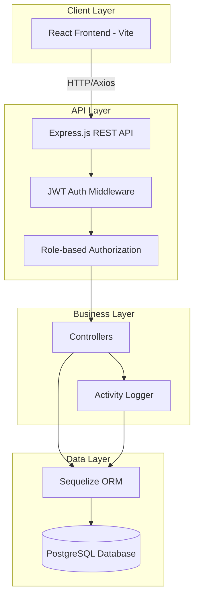
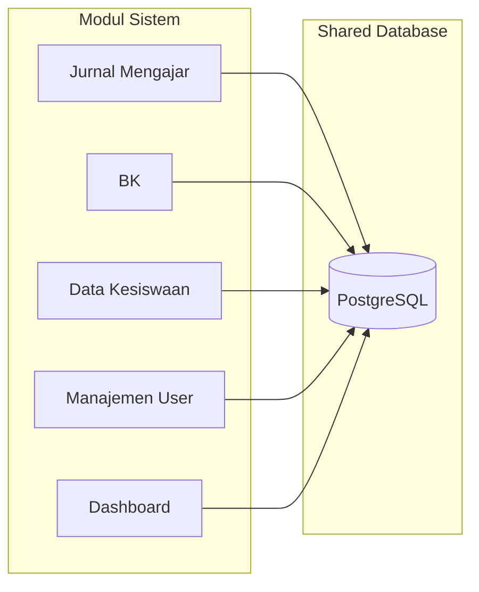
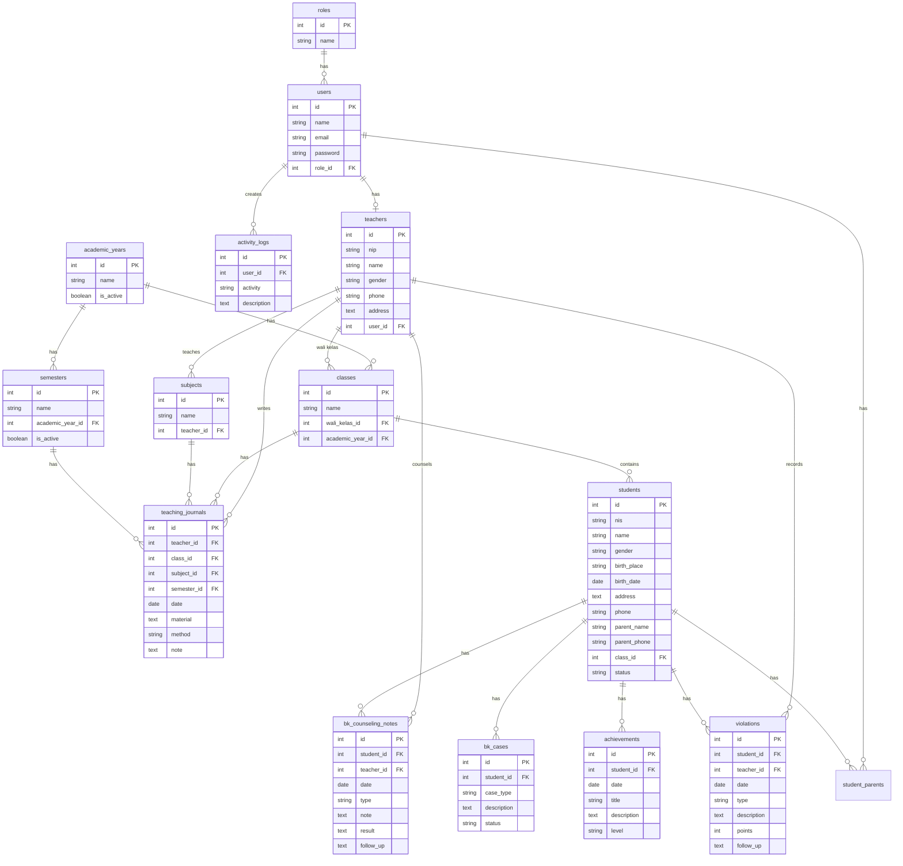

# 🎓 EduScale — Scalable School Management System

## Deskripsi Singkat

EduScale adalah Sistem Manajemen Sekolah berbasis web yang dibangun dengan arsitektur fullstack (React + Express + PostgreSQL). Sistem ini dirancang dengan prinsip **Scalable System Design** untuk mengelola data akademik, kesiswaan, jurnal mengajar, dan bimbingan konseling secara terintegrasi dalam satu database utama.

---

## 👥 Anggota Kelompok

| No | Nama | NIM | Tugas |
|----|------|-----|-------|
| 1 | Rezky Amaliah Rusli | 105841120223 | Frontend Development (React), UI/UX Design, penyusunan cover & kesimpulan laporan |
| 2 | Musdalipa | 105841121623 | Backend Development (Express.js), Database Design (PostgreSQL + Sequelize ORM), penyusunan bagian arsitektur, ERD, dan rancangan vCPU |
| 3 | Nurdian | 105841118923 | Modul BK (Bimbingan Konseling), Testing & Quality Assurance, Dokumentasi, penyusunan use case dan analisis risiko |
| 4 | Wafiq Azizah | 105841120923 | Security and Access Control Designer .perancangan autentikasi (JWT), Role-Based Access Control (RBAC), analisis keamanan sistem, serta penyusunan analisis risiko dan mekanisme pengamanan akses pengguna |

---

## 📦 Daftar Modul

### Modul Utama (Wajib)
1. **Modul Jurnal Mengajar** — Pencatatan aktivitas pembelajaran oleh guru
2. **Modul BK (Bimbingan Konseling)** — Pencatatan konseling, pelanggaran, prestasi, dan kasus BK
3. **Modul Data Kesiswaan** — Pengelolaan data siswa, kelas, dan wali kelas
4. **Modul Manajemen Pengguna** — Pengelolaan akun, role, dan audit log

### Modul Pendukung
5. **Dashboard Analytics** — Statistik dan grafik data sekolah secara real-time
6. **Modul Data Guru** — Pengelolaan data guru dan NIP
7. **Modul Pengaturan** — Kelola mata pelajaran, tahun ajaran, dan semester

---

## 🛠️ Teknologi yang Digunakan

| Layer | Teknologi | Versi |
|-------|-----------|-------|
| **Frontend** | React | 19.x |
| **Bundler** | Vite | 8.x |
| **Styling** | TailwindCSS | 4.x |
| **Charts** | Chart.js + react-chartjs-2 | 4.x / 5.x |
| **Icons** | Lucide React | 1.x |
| **HTTP Client** | Axios | 1.x |
| **Routing** | React Router DOM | 7.x |
| **Backend** | Express.js | 5.x |
| **Database** | PostgreSQL | 15+ |
| **ORM** | Sequelize | 6.x |
| **Auth** | JWT + bcrypt | - |
| **Runtime** | Node.js | 18+ |

---

## 📂 Struktur Folder Proyek

```
eduscale/
├── README.md
│
├── eduscale-backend/
│   ├── .env
│   ├── package.json
│   └── src/
│       ├── server.js              # Entry point server
│       ├── app.js                 # Express app + route registration
│       ├── config/
│       │   └── database.js        # Sequelize + PostgreSQL config
│       ├── models/                # Sequelize models
│       │   ├── index.js           # Model registry + relationships
│       │   ├── Role.js
│       │   ├── User.js
│       │   ├── Student.js
│       │   ├── Teacher.js
│       │   ├── Class.js
│       │   ├── Subject.js
│       │   ├── AcademicYear.js
│       │   ├── Semester.js
│       │   ├── TeachingJournal.js
│       │   ├── BKCase.js
│       │   ├── BKCounseLing.js
│       │   ├── Violation.js
│       │   ├── Achievement.js
│       │   ├── StudentParent.js
│       │   └── Activity.js
│       ├── controllers/           # Business logic
│       │   ├── authController.js
│       │   ├── studentController.js
│       │   ├── teacherController.js
│       │   ├── classController.js
│       │   ├── subjectController.js
│       │   ├── teachingJournalController.js
│       │   ├── bkController.js
│       │   ├── userController.js
│       │   ├── roleController.js
│       │   ├── dashboardController.js
│       │   ├── activityController.js
│       │   └── academicYearController.js
│       ├── routes/                # API route definitions
│       │   ├── authRoutes.js
│       │   ├── studentRoutes.js
│       │   ├── teacherRoutes.js
│       │   ├── classRoutes.js
│       │   ├── subjectRoutes.js
│       │   ├── teachingJournalRoutes.js
│       │   ├── bkRoutes.js
│       │   ├── userRoutes.js
│       │   ├── dashboardRoutes.js
│       │   ├── academicYearRoutes.js
│       │   └── activityRoutes.js
│       ├── middleware/
│       │   ├── authMiddleware.js   # JWT verification
│       │   └── roleMiddleware.js   # Role-based authorization
│       ├── utils/
│       │   ├── generateToken.js
│       │   └── logActivity.js
│       └── seeders/
│           └── createUsers.js      # Seed demo data
│
└── eduscale-frontend/
    ├── package.json
    ├── vite.config.js
    ├── index.html
    └── src/
        ├── main.jsx
        ├── App.jsx
        ├── App.css
        ├── index.css
        ├── api.js                  # Axios instance + interceptors
        ├── context/
        │   └── AuthContext.jsx     # Authentication state management
        ├── routes/
        │   ├── AppRoutes.jsx       # Route definitions
        │   └── ProtectedRoute.jsx  # Auth + role guard
        ├── layout/
        │   ├── AdminLayout.jsx     # Main layout wrapper
        │   ├── Sidebar.jsx         # Dynamic sidebar (role-based menu)
        │   └── Navbar.jsx          # Top navigation bar
        └── pages/
            ├── Login.jsx
            ├── Dashboard.jsx
            ├── Students.jsx
            ├── Teachers.jsx
            ├── Classes.jsx
            ├── TeachingJournal.jsx
            ├── BKCases.jsx
            ├── Users.jsx
            ├── AuditLog.jsx
            ├── Settings.jsx
            └── ChangePassword.jsx
```

---

## 🏗️ Rancangan Arsitektur Sistem





---

## 🗄️ Rancangan Database (ERD)



---

## ⚙️ Cara Instalasi

### Prerequisites
- Node.js 18+
- PostgreSQL 15+
- npm atau yarn

### 1. Clone Repository
```bash
git clone https://github.com/Musdalipa24/eduscale.git
cd eduscale
```

### 2. Setup Database
```sql
-- Buat database di PostgreSQL
CREATE DATABASE eduscale;
```

### 3. Setup Backend
```bash
cd eduscale-backend
npm install

# Konfigurasi .env (sesuaikan dengan database lokal)
# PORT=5000
# DB_NAME=eduscale
# DB_USER=postgres
# DB_PASSWORD=your_password
# DB_HOST=localhost
# DB_PORT=5432
# JWT_SECRET=eduscale_secret_key
```

### 4. Setup Frontend
```bash
cd eduscale-frontend
npm install
```

---

## 🚀 Cara Menjalankan Aplikasi

### 1. Jalankan Backend
```bash
cd eduscale-backend
npm run dev
```
Tunggu sampai muncul:
```
✅ Database Connected
✅ Database Synchronized
🚀 Server running on port 5000
```

### 2. Seed Data Awal
```bash
cd eduscale-backend
node src/seeders/createUsers.js
```

### 3. Jalankan Frontend
```bash
cd eduscale-frontend
npm run dev
```
Buka browser: `http://localhost:5173`

---

## 🔑 Akun Login Demo

| Role | Email | Password |
|------|-------|----------|
| **Admin** | admin@eduscale.com | admin123 |
| **Kepala Sekolah** | kepsek@eduscale.com | kepsek123 |
| **Guru** | guru@eduscale.com | guru123 |
| **Guru BK** | bk@eduscale.com | bk123 |
| **Wali Kelas** | walikelas@eduscale.com | walikelas123 |
| **Siswa** | siswa@eduscale.com | siswa123 |
| **Orang Tua** | ortu@eduscale.com | ortu123 |

---

## 🎥 Link Video Presentasi YouTube

https://youtu.be/aD4ZrXRPlL0

---

## 🔄 Penjelasan Unsur Scalable System Design

### 1. Modular Architecture
Setiap modul (Jurnal, BK, Kesiswaan, User Management) berjalan independen dengan controller, route, dan model masing-masing. Modul baru dapat ditambahkan tanpa mengubah modul yang sudah ada — cukup buat model, controller, dan route baru, lalu daftarkan di `app.js`.

### 2. Stateless RESTful API
Backend menggunakan arsitektur REST stateless dengan JWT token. Server tidak menyimpan session, sehingga dapat di-scale secara horizontal (menambah instance server) dengan load balancer tanpa masalah.

### 3. Role-Based Access Control (RBAC)
Sistem hak akses berbasis role yang fleksibel:
- 7 role default yang dapat ditambah
- Middleware authorization reusable: `authorizeRoles("Admin", "Guru")`
- Menu sidebar frontend menyesuaikan otomatis berdasarkan role
- Mudah menambah role baru tanpa mengubah logic yang ada

### 4. Shared Database with Normalized Schema
Seluruh modul menggunakan satu database PostgreSQL yang ternormalisasi:
- Data siswa, guru, kelas, mapel digunakan bersama oleh semua modul
- Foreign key relationships menjaga integritas data
- Tidak ada duplikasi data antar modul

### 5. Horizontal Scalability Ready
- **Database**: PostgreSQL mendukung read replicas, connection pooling, dan partitioning
- **Backend**: Express.js stateless, bisa dijalankan multi-instance di belakang load balancer (Nginx)
- **Frontend**: Static build (Vite), bisa di-serve dari CDN

### 6. Separation of Concerns
```
Frontend (React) ←→ API Layer (Express) ←→ Data Layer (Sequelize/PostgreSQL)
```
Setiap layer bisa di-scale dan di-deploy secara terpisah. Frontend bisa di-host di Vercel/Netlify, backend di Railway/Render, database di managed PostgreSQL.

### 7. Pagination & Filtering
Semua endpoint yang menampilkan data list mendukung:
- Pagination (limit/offset)
- Search query
- Filter berdasarkan relasi
Ini memastikan performa tetap baik saat jumlah data bertambah.

### 8. Activity Logging
Sistem audit log yang mencatat setiap perubahan data, memungkinkan tracking dan accountability saat jumlah pengguna meningkat.

---

## 📋 Hak Akses per Role

| Fitur | Admin | Kepsek | Guru | Guru BK | Wali Kelas | Siswa | Ortu |
|-------|:-----:|:------:|:----:|:-------:|:----------:|:-----:|:----:|
| Dashboard | ✅ | ✅ | ✅ | ✅ | ✅ | ✅ | ✅ |
| Data Siswa | CRUD | View | - | View | View (kelas) | - | - |
| Data Guru | CRUD | - | - | - | - | - | - |
| Data Kelas | CRUD | - | - | - | - | - | - |
| Jurnal Mengajar | View | View | CRUD | - | View | - | - |
| BK | CRUD | View | - | CRUD | View (kelas) | - | - |
| Manajemen User | CRUD | - | - | - | - | - | - |
| Audit Log | View | - | - | - | - | - | - |
| Pengaturan | CRUD | - | - | - | - | - | - |
| Ganti Password | ✅ | ✅ | ✅ | ✅ | ✅ | ✅ | ✅ |
